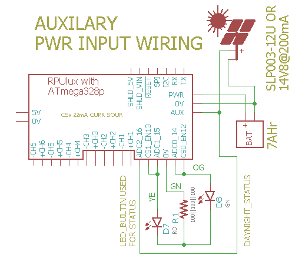

# Alternat Power Input

## Overview

Alternat power input is a DIY hack used to send current from a solar panel into a battery. 

This is a risky DIY feature, so only use it if you have the tools and knowhow to repair damaged surface mount parts. 

The alternat power source needs to act as a current source (I suggest starting with less than 1A), and the main power source needs to act like a battery. Do not attempt this with a bench power supply as the main power input. When the alternat power is enabled it must current limit and then charge the battery.

Again this is easy to damage so be prepared to fix damaged parts.


## Wiring Needed




# Firmware Upload

With a serial port connection (set the BOOT_PORT in Makefile) and optiboot installed on the RPUlux run 'make bootload' and it should compile and then flash the MCU.

``` 
rsutherland@conversion:~/Samba/hg/RPUlux/Alternat$ make bootload
...
avrdude done.  Thank you.
``` 

Now connect with picocom (or ilk). Note I am often at another computer doing this through SSH. The Samba folder is for editing the files from Windows.


``` 
#exit is C-a, C-x
picocom -b 38400 /dev/ttyUSB0
``` 

# Commands

Commands are interactive over the serial interface at 38400 baud rate. The echo will start after the second character of a new line. 


## /\[rpu_address\]/\[command \[arg\]\]

rpu_address is taken from the I2C address 0x29 (e.g. get_Rpu_address() which is included form ../lib/rpu_mgr.h). The value of rpu_address is used as a character in a string, which means don't use a null value (C strings are null terminated) as an adddress. The ASCII value for '1' (0x31) is easy and looks nice, though I fear it will cause some confusion when it is discovered that the actual address value is 49.

Commands and their arguments follow.


## /0/id? \[name|desc|avr-gcc\]

identify 

``` 
/1/id?
{"id":{"name":"Alternat","desc":"RPUlux (17323^0) Board /w atmega328p","avr-gcc":"5.4.0"}}
```

##  /0/trackalt?

This will turn on the Alternat Power after a delay (22.5 sec) and log the data to the serial output until the host sends a character.

``` 
/1/trackalt?
{"millis":"0","ADC3":"14.69""PWR_I":"0.000""PWR_V":"13.01"}
{"millis":"5000","ADC3":"14.69""PWR_I":"0.000""PWR_V":"13.01"}
{"millis":"10000","ADC3":"14.69""PWR_I":"0.000""PWR_V":"13.01"}
{"millis":"15000","ADC3":"14.69""PWR_I":"0.000""PWR_V":"13.01"}
{"millis":"20000","ADC3":"14.69""PWR_I":"0.000""PWR_V":"13.01"}
{"millis":"25000","ADC3":"13.51""PWR_I":"0.000""PWR_V":"13.08"}
{"millis":"30000","ADC3":"13.54""PWR_I":"0.000""PWR_V":"13.11"}
{"millis":"35000","ADC3":"13.54""PWR_I":"0.000""PWR_V":"13.11"}
{"millis":"40000","ADC3":"13.58""PWR_I":"0.000""PWR_V":"13.15"}
{"millis":"45000","ADC3":"13.58""PWR_I":"0.000""PWR_V":"13.15"}
{"millis":"50000","ADC3":"13.62""PWR_I":"0.000""PWR_V":"13.15"}
{"millis":"55000","ADC3":"13.62""PWR_I":"0.000""PWR_V":"13.19"}
```


