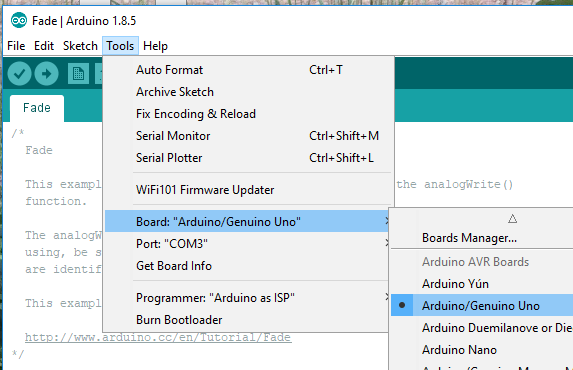

# Arduino IDE

## Overview

Program with [Arduino IDE]. The RPUlux has the same ATmega328p as an Uno. It is wired on the board like I would do when using six Spakfun [FemtoBuck] (or two [PicoBuck]).

[Arduino IDE]: https://www.arduino.cc/en/Main/Software
[FemtoBuck]: https://www.sparkfun.com/products/13716
[PicoBuck]: https://www.sparkfun.com/products/13705

# Bootload Port

Connect an [FTDI Friend] or [USBuart] to the bootload port.

[FTDI Friend]: https://www.adafruit.com/product/284
[USBuart]: https://github.com/epccs/Driver/tree/master/USBuart

# Firmware Upload

Use the IDE to select an Uno for programing and then upload the sketch.

