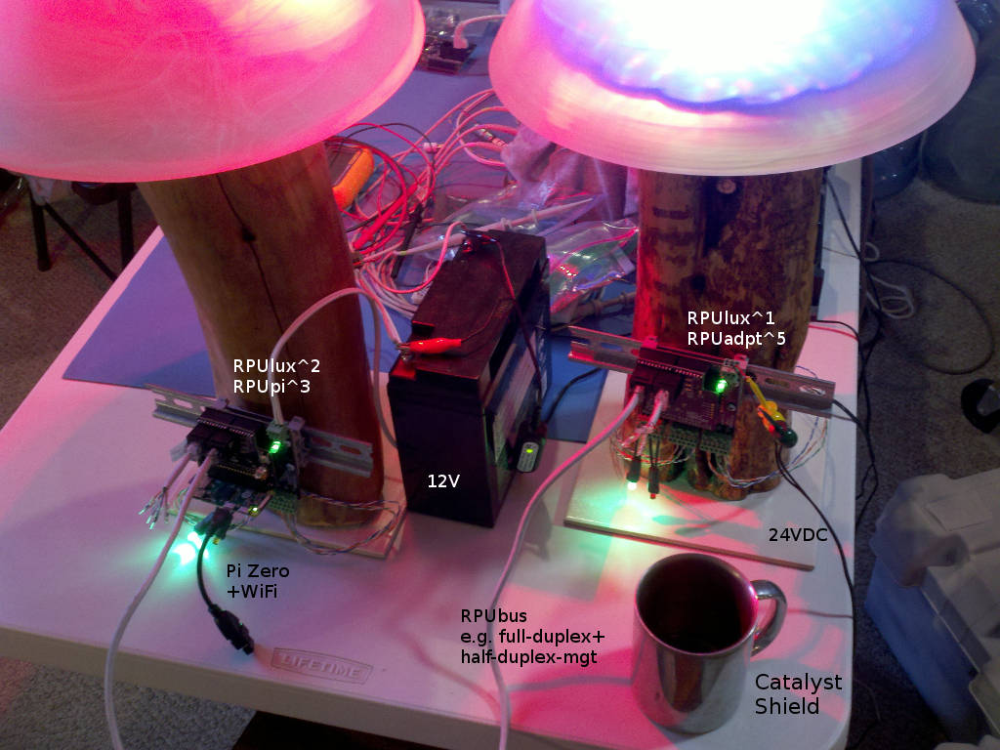
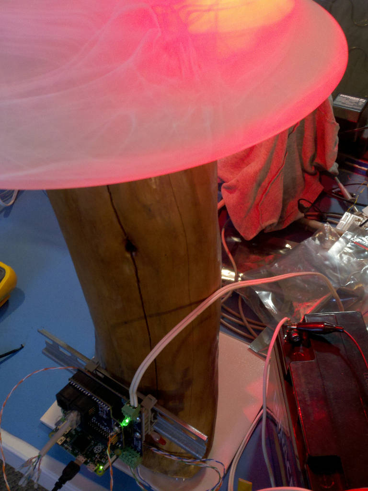

# Description

This shows the setup and method used for evaluation of RPUlux.

# Table of References


# Table Of Contents:

1. ^2 PWM modes
1. ^2 Using Shields for Managed Serial Bus 
1. ^1 AL8805 Curr Sense is like Datasheet
1. ^1 Demo Setup
1. ^1 AL8805 Curr Sense is Unlike Datasheet

## ^2 PWM modes

Timer0, Timer1, Timer2 each have two output compare pins (e.g. Timer0 have OC0A and OC0B) that can generate PWM waveform. 

Timer0 is set for Fast PWM Mode see ATmega328 datasheet 15.73 (page 99)

Timer1 and Timer2 are set in Phase Correct PWM Mode see ATmega328 datasheet 15.7.4 (page 100)

Timer0 prescaler is 64 and it counts up to 256 which gives a frequency of 976.56Hz.

Timer1 and Timer2 have a prescaler of 64 and count up to 255 and then down to zero which gives a frequency of 490.2Hz

Using phase-correct PWM on Timer0 means that it overflows half as often resulting in different millis() behavior than is currently in place. The micros() function will not work with phase-correct mode. The LED drivers are rated for 500Hz PWM frequency but they are working with the Fast PWM mode for me, so I am going to keep the timing functions as they are.


## ^2 Using Shields for Managed Serial Bus



RPUpi moved to the new RPUlux^2 and put a RPUadpt^5 on the PUlux^1.

The Pi Zero has a WiFi dongle so I can SSH into it remotely. The RPUbus goes over the ubiquitous CAT5 cable wired for ethernet (not the crossover variant).

Headless computers are a paradigm shift, I worry about how I will fix it if something goes wrong, but after switching from Raspbian Jessie to Stretch by way of a clean install I guess in the worst case it is easy enough to sanitize. 


Notes firmware could be written to shutdown the battery backed Pi if the power is out for an extended period. The Wifi and network services (DHCP,DNS Host Mapping) also need to be battery backed for a laptop to be able to access them.


## ^1 AL8805 Curr Sense is like Datasheet

Now that the SelfTest is useing the pwm pins in a push-pull mode lets see what the current in LED's is for this ^1 unit that I have used 0.15 Ohm set resistors.

```
...
Terminal ready
RPUlux Self Test date: Mar 29 2018
avr-gcc --version: 5.4.0
I2C provided address 0x31 from serial bus manager
adc reading for PWR_V: 357
PWR at: 12.740 V
ADC0 GN LED /W SINK on and CS*_EN off: 0.000 V
ADC1 RD LED /W SINK on and CS*_EN off: 0.000 V
ADC2 R1 /W CS*_EN off: 0.000 V
ADC3 R1 /W CS*_EN off: 0.000 V
CS0 curr source on R1: 0.022 A
Green LED fwd V: 2.225 V
CS1 curr source on R1: 0.022 A
Red LED fwd V: 2.104 V
   ADC2 reading used to calculate ref_intern_1v1_uV: 698 A
   calculated ref_intern_1v1_uV: 1071511 uV
REF_EXTERN_AVCC old value was in eeprom: 4986100 uV
REF_INTERN_1V1 old value was in eeprom: 1071451 uV
REF_EXTERN_AVCC saved in eeprom: 4986100 uV
REF_INTERN_1V1 saved in eeprom: 1071511 uV
PWR_I with !CS1_EN use INTERNAL_1V1: 0.010 A
PWR_I with CH1 LED, 1V1, 1sec: 0.216 A
PWR_I with CH1 LED, 1V1, 3sec: 0.215 A
Approximate CH1 curr on a 3.2V LED: 0.652 A
>>> CH1 curr is to high.
Approximate CH1 curr /w weak pull-up on a 3.2V LED: 0.284 A
PWR_I with CH2 LED, 1V1, 1sec: 0.213 A
PWR_I with CH2 LED, 1V1, 3sec: 0.212 A
Approximate CH2 curr on a 3.2V LED: 0.642 A
>>> CH2 curr is to high.
Approximate CH2 curr /w weak pull-up on a 3.2V LED: 0.283 A
PWR_I with CH3 LED, 1V1, 1sec: 0.219 A
PWR_I with CH3 LED, 1V1, 3sec: 0.218 A
Approximate CH3 curr on a 3.2V LED: 0.661 A
>>> CH3 curr is to high.
Approximate CH3 curr /w weak pull-up on a 3.2V LED: 0.290 A
PWR_I with CH4 LED, 1V1, 1sec: 0.213 A
PWR_I with CH4 LED, 1V1, 3sec: 0.212 A
Approximate CH4 curr on a 3.2V LED: 0.643 A
>>> CH4 curr is to high.
Approximate CH4 curr /w weak pull-up on a 3.2V LED: 0.274 A
PWR_I with CH5 LED, 1V1, 1sec: 0.222 A
PWR_I with CH5 LED, 1V1, 3sec: 0.220 A
Approximate CH5 curr on a 3.2V LED: 0.669 A
>>> CH5 curr is to high.
Approximate CH5 curr /w weak pull-up on a 3.2V LED: 0.281 A
PWR_I with CH6 LED, 1V1, 1sec: 0.221 A
PWR_I with CH6 LED, 1V1, 3sec: 0.220 A
Approximate CH6 curr on a 3.2V LED: 0.668 A
>>> CH6 curr is to high.
Approximate CH6 curr /w weak pull-up on a 3.2V LED: 0.283 A
[FAIL]
```

Those values are correct, I have been running this ^1 board with a PWM setting of 32 for about four weeks now. I was able to operat four channels with three LED's per channel at 12.8V and 100% duty in push-pull mode befor reaching the input current max that I can read on ADC6. The LED's got hotter than I was expecting but I was operating them at twice the current I thought. I think this is a good indication that 330mA is going to give a very long life with the Cree XPE2 LED.

After changing the set resistor back to 0.3 Ohm, and changing the pulldown from 8.45k Ohm to 3.74k Ohm the self test shows.

```
...
Terminal ready
RPUlux Self Test date: Mar 29 2018
avr-gcc --version: 5.4.0
I2C provided address 0x31 from serial bus manager
adc reading for PWR_V: 356
PWR at: 12.705 V
ADC0 GN LED /W SINK on and CS*_EN off: 0.000 V
ADC1 RD LED /W SINK on and CS*_EN off: 0.000 V
ADC2 R1 /W CS*_EN off: 0.000 V
ADC3 R1 /W CS*_EN off: 0.000 V
CS0 curr source on R1: 0.022 A
Green LED fwd V: 2.225 V
CS1 curr source on R1: 0.022 A
Red LED fwd V: 2.113 V
   ADC2 reading used to calculate ref_intern_1v1_uV: 700 A
   calculated ref_intern_1v1_uV: 1068450 uV
REF_EXTERN_AVCC old value was in eeprom: 4986100 uV
REF_INTERN_1V1 old value was in eeprom: 1071451 uV
REF_EXTERN_AVCC saved in eeprom: 4986100 uV
REF_INTERN_1V1 saved in eeprom: 1068450 uV
PWR_I with !CS1_EN use INTERNAL_1V1: 0.010 A
PWR_I with CH1 LED, 1V1, 1sec: 0.111 A
PWR_I with CH1 LED, 1V1, 3sec: 0.111 A
Approximate CH1 curr on a 3.2V LED: 0.320 A
Approximate CH1 curr /w weak pull-up on a 3.2V LED: 0.090 A
PWR_I with CH2 LED, 1V1, 1sec: 0.110 A
PWR_I with CH2 LED, 1V1, 3sec: 0.110 A
Approximate CH2 curr on a 3.2V LED: 0.317 A
Approximate CH2 curr /w weak pull-up on a 3.2V LED: 0.087 A
PWR_I with CH3 LED, 1V1, 1sec: 0.113 A
PWR_I with CH3 LED, 1V1, 3sec: 0.113 A
Approximate CH3 curr on a 3.2V LED: 0.325 A
Approximate CH3 curr /w weak pull-up on a 3.2V LED: 0.090 A
PWR_I with CH4 LED, 1V1, 1sec: 0.110 A
PWR_I with CH4 LED, 1V1, 3sec: 0.109 A
Approximate CH4 curr on a 3.2V LED: 0.314 A
Approximate CH4 curr /w weak pull-up on a 3.2V LED: 0.084 A
PWR_I with CH5 LED, 1V1, 1sec: 0.112 A
PWR_I with CH5 LED, 1V1, 3sec: 0.112 A
Approximate CH5 curr on a 3.2V LED: 0.322 A
Approximate CH5 curr /w weak pull-up on a 3.2V LED: 0.087 A
PWR_I with CH6 LED, 1V1, 1sec: 0.112 A
PWR_I with CH6 LED, 1V1, 3sec: 0.111 A
Approximate CH6 curr on a 3.2V LED: 0.321 A
Approximate CH6 curr /w weak pull-up on a 3.2V LED: 0.087 A
[PASS]
```


## ^1 Demo Setup

Build a demo setup. I used some firewood to make a lamp, it has a hole drilled from the top to the bottome (that is no easy task to get alligned). I soldered some copper grounding wire togather to act as a frame and a heat spreader for the LED's. There are two [RD] and four [WH] strings each having three Cree XPE2 LED. The three up board configuration needs to disipate 3 Watts of heat at 330mA, whith will get to hot without some sort of heat spreader. 

[RD]: https://www.ledsupply.com/leds/cree-xlamp-xp-e2-color-high-power-led-star
[WH]: https://www.ledsupply.com/leds/cree-xlamp-xpe2-white-high-power-led

A Raspbery Pi Zero running Raspian stretch lite is installed on an RPUpi^3 shield (it has a WiFi dongle). 

This setup was let run a few weeks with a red led channel set to PWM at 32. The battery charger seems to keep, but since the firmware is not smart about turning off the Pi Zero I did not want to risk a demanding load. 



Although the AL8805 is not doing what the datasheet says it does seem to operate correctly.


## ^1 AL8805 Curr Sense is Unlike Datasheet

The datasheet example layout shows switching current (e.g. AC) flowing between the AL8805 sense pins. My ^1 design does not follow the datasheet layout. I find the sense resistor size is about half of what the datasheet suggests.

Using 0.15 Ohm (rather than 0.3 Ohm) gives 330mA on the LED channels. 

The next version ^2 will let switching current flow under the sense resistor to the VIN bypass, so it will use 0.3 Ohm to run at 330mA.
