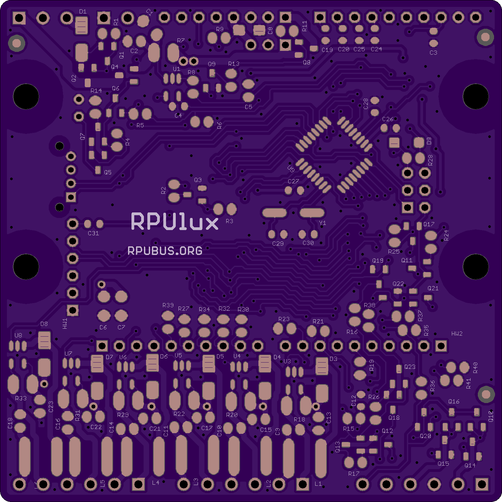
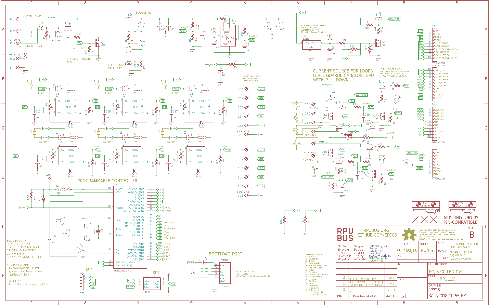

# Hardware

## Overview

This board has an ATmega328p and and six AL8805 constant current LED drivers. Input power is 7 to 36 VDC. 

Bootloader options include [optiboot] and [xboot]. Serial bootloaders can't change the hardware fuse setting which reduces programming errors that can accidentally brick the controller. 

[optiboot]: https://github.com/MCUdude/optiboot_flash
[xboot]: https://github.com/alexforencich/xboot

## Inputs/Outputs/Functions

```
        ATmega328p programs are compiled with open source tools that run nearly everywhere.
        Input power can range from 7 to 36V DC.
        Reverse Power Protection with indicator LED and low loss.
        Shield VIN pin can be disabled (2).
        Alternate Input Power can be enabled (8).
        The high side VIN current sensor is connected to ADC6.
        Power VIN voltage is divided down and connected to ADC7.
        Three digital input/outputs (14, 15, 16) with level shift for connecting to a higher voltage.
        The digital inputs are also connected to ADC channels (ADC0, ADC1, ADC2).
        The digital inputs also have current sinking N-CH MOSFET that may be enabled (4, 7)
        Two 22mA current sources may be enabled (12, 13) for current loop sensors.
```

## Uses

```
        Six AL8805 buck converters drive constant current through LED channels
        Each LED channel has a 500Hz PWM control line from the ATmega328p.
        Allows control of two RGB color lighting sources.
        Sink solar panel power when the battery is full, and measure approximate current with Rds_on.
```

## Notice

```
        AREF from ATmega328p is not connected to the header.
        3V3 is not present on the board and the header pin is not connected.
        ADC4 and ADC5 are used for I2C and not connected to the analog header.
```


# Table Of Contents

1. [Status](#status)
2. [Design](#design)
3. [Bill of Materials](#bill-of-materials)
4. [Assembly](#assembly)
5. [How To Use](#how-to-use)


# Status


```
        ^1  Done: Design, Layout, BOM,
            WIP: Review*,
            Todo: Order Boards, Assembly, Testing, Evaluation.
            *during review the Design may change without changing the revision.
            add pull-down to IO8
            add pull-down to PWM's (IO[3569],nSS,MOSI]
            add pull-down to CS0_EN and CS1_EN
            add pull-down to NMOS IO4 and IO7
            add 100k to Q1 zener for leakage current
            LED driver CC SMPS is dumping current into 0V plane 
            remove NMOS sink on IO8 so it is only doing ALT_EN function

        ^0  Done: Design, Layout, BOM, Review*, Order Boards, Assembly, Testing,
            WIP: Evaluation.
            location: 2018-22-1 bench.
```

Debugging and fixing problems i.e. [Schooling](./Schooling/)

Setup and methods used for [Evaluation](./Evaluation/)


# Design

The board is 0.063 thick, FR4, two layer, 1 oz copper with ENIG (gold) finish.




## Mounting

```
DIN rail
```

## Electrical Schematic



## Testing

Check correct assembly and function with [Testing](./Testing/)


# Bill of Materials

The BOM is a CVS file(s), import it into a spreadsheet program like LibreOffice Calc (or Excel), or use a text editor.

Option | BOM's included
----- | ----- 
A. | [BRD] 
M. | [BRD] [SMD] [HDR] 
W. | [BRD] [SMD] [HDR] [PLUG]
Z. | [BRD] [SMD] [HDR] [PLUG] [DIN]

[BRD]: ./Design/17323BRD,BOM.csv
[SMD]: ./Design/17323SMD,BOM.csv
[HDR]: ./Design/17323HDR,BOM.csv
[PLUG]: ./Design/17323PLUG,BOM.csv
[DIN]: ./Design/17323DIN,BOM.csv


# Assembly

## SMD

The board is assembled with CHIPQUIK no-clean solder SMD291AX (RoHS non-compliant). 

The SMD reflow is done in a Black & Decker Model NO. TO1303SB which has the heating elements controlled by a Solid State Relay and an ATMega328p loaded with this [Reflow] firmware.

[Reflow]: ../Reflow


# How To Use

## Prevent overcharging a battery

I do not recomend the DIY power electronics options, I recomend a charge controller like the [SunSaver-6L] which provides a lot of protection. 

[SunSaver-6L]: https://www.solar-electric.com/ss-6l.html

The following is some DIY approaches to prevent overcharging a battery with a solar panel. They are risky so expect to damage somthing e.g. the battery, solar panel, RPUlux board. This means you may have to replace surface mount parts, the bill of materials will tell you what to use, and the assembly drawings show where they are used. With some luck Digikey or Mouser will have the parts in stock. Again don't do this if you don't want to rework SMD parts.


Another option is to write software that controls IO8 to open circuit the solar panel that is connected to the alternate power input. The alternate power input must be less than 2 amps it is for small solar panels which normaly lack by-pass diodes.


Software that controls IO4 can operate an SSR to open circuit the solar panel. This option is for solar panels that lack by-pass diodes and produce over 1.5A short-circuit current. Note the onboard N-CH MOSFET will connect the solar pannel to the battery when it pulls down.


Use software to control IO4 and IO7 which are each connected to an onboard N-CH MOSFET that can short a solar panel. The control logic is reversed from that of the SSR circuit above, e.g. the onboard N-CH MOSFET will short the solar pannel and bypass the current. A blocking diode is needed to prevent the battery from supplying current into the short and the panel must be equipped with by-pass diodes. Note that small panels normaly lack by-pass diodes and shorting a panel without bypass diodes can result in a Zener breakdown failure.


## LED options

I have no connection with this outfit I am just looking...

* [RGB] Cree XP-E2 350mA flux (67.2/107/23.5)
* [Color] Cree XP-E2 having colors of DWL 450:465:520:565:585:610:620
* [White] Cree XP-E2 350mA flux 116

[RGB]: https://www.ledsupply.com/leds/cree-xpe2-rgb-high-power-led
[Color]: https://www.ledsupply.com/leds/cree-xlamp-xp-e2-color-high-power-led-star
[White]: https://www.ledsupply.com/leds/cree-xlamp-xpe2-white-high-power-led

If the the White forward voltage is less than 3.25V then a string of three would have 9.75V and that should just about work with a 12V input.


# Original Ideas

This board combines ideas from Sparkfun's [PicoBuck], Arduinos [Uno], and my own take on board design and hardware interfacing. It has shields [RPUpi] and [RPUadpt] that I also designed, the goal is to alow a daisy-chain serial to the Raspberry Pi Zero which is able to be a host computer, compile firmware and upload it to the control board(s) using an open source toolchain.

[PicoBuck]: https://www.sparkfun.com/products/13705
[Uno]: https://store.arduino.cc/usa/arduino-uno-rev3
[RPUpi]: https://github.com/epccs/RPUpi/
[RPUadpt]: https://github.com/epccs/RPUadpt
