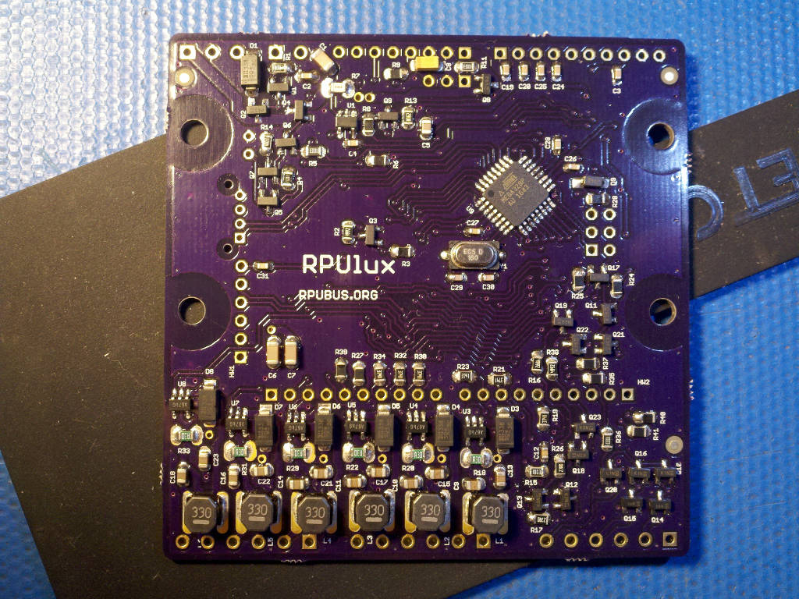

# Hardware

## Overview

This board has an ATmega328p and and six AL8805 constant current LED drivers. The reset is TBD.

Bootloader options include [optiboot] and [xboot]. Serial bootloaders can't change the hardware fuse setting which reduces programming errors that can accidentally brick the controller. 

[optiboot]: https://github.com/Optiboot/optiboot
[xboot]: https://github.com/alexforencich/xboot

## Inputs/Outputs/Functions

```
        ATmega328p programs are compiled with open source tools that run nearly everywhere.
        Input power can range from 7 to 36V DC
        High side current sense of input power is connected to ADC6.
        Input power voltage is divided down and connected to ADC7.
        Three digital or analog input/outputs (D14/ADC0,D15/ADC1,D16/ADC3) with level conversion.
        IO4, IO7, and IO8 control current sinking N-CH MOSFET connected to ADC0, ADC1, and ADC2.
        IO12 and IO13 each control 22mA current source.
```

## Uses

```
        Six AL8805 buck converters drive constant current through LED channels
        Each LED channel has a 500Hz PWM control line from the ATmega328p.
        Allows control of two RGB color lighting sources.
        Sink solar panel power when the battery is full, and measure approximate current with Rds_on.
```

## Notice

```
        AREF from ATmega328p is not connected to the header.
        3V3 is not present on the board, the header pin is not connected.
```


# Table Of Contents

1. [Status](#status)
2. [Design](#design)
3. [Bill of Materials](#bill-of-materials)
4. [Assembly](#assembly)
5. [How To Use](#how-to-use)


# Status


```
        ^0  Done: Design, Layout,
            WIP: BOM,
            Todo: Review*, Order Boards, Assembly, Testing, Evaluation.
            *during review the Design may change without changing the revision.
```

Debugging and fixing problems i.e. [Schooling](./Schooling/)

Setup and methods used for [Evaluation](./Evaluation/)


# Design

The board is 0.063 thick, FR4, two layer, 1 oz copper with ENIG (gold) finish.





## Electrical Parameters (Typical)

```
TBD
```

## Mounting

```
DIN rail
```

## Electrical Schematic


## Testing

Check correct assembly and function with [Testing](./Testing/)


# Bill of Materials

The BOM is a CVS file(s), import it into a spreadsheet program like LibreOffice Calc (or Excel), or use a text editor.

Option | BOM's included
----- | ----- 
A. | [BRD] 
M. | [BRD] [SMD] [HDR] 
W. | [BRD] [SMD] [HDR] [PLUG]
Z. | [BRD] [SMD] [HDR] [PLUG] [DIN]

[BRD]: ./Design/17323BRD,BOM.csv
[SMD]: ./Design/17323SMD,BOM.csv
[HDR]: ./Design/17323HDR,BOM.csv
[PLUG]: ./Design/17323PLUG,BOM.csv
[DIN]: ./Design/17323DIN,BOM.csv


# Assembly

## SMD

The board is assembled with CHIPQUIK no-clean solder SMD291AX (RoHS non-compliant). 

The SMD reflow is done in a Black & Decker Model NO. TO1303SB which has the heating elements controlled by a Solid State Relay and an ATMega328p loaded with this [Reflow] firmware.

[Reflow]: ../Reflow


# How To Use


TBD