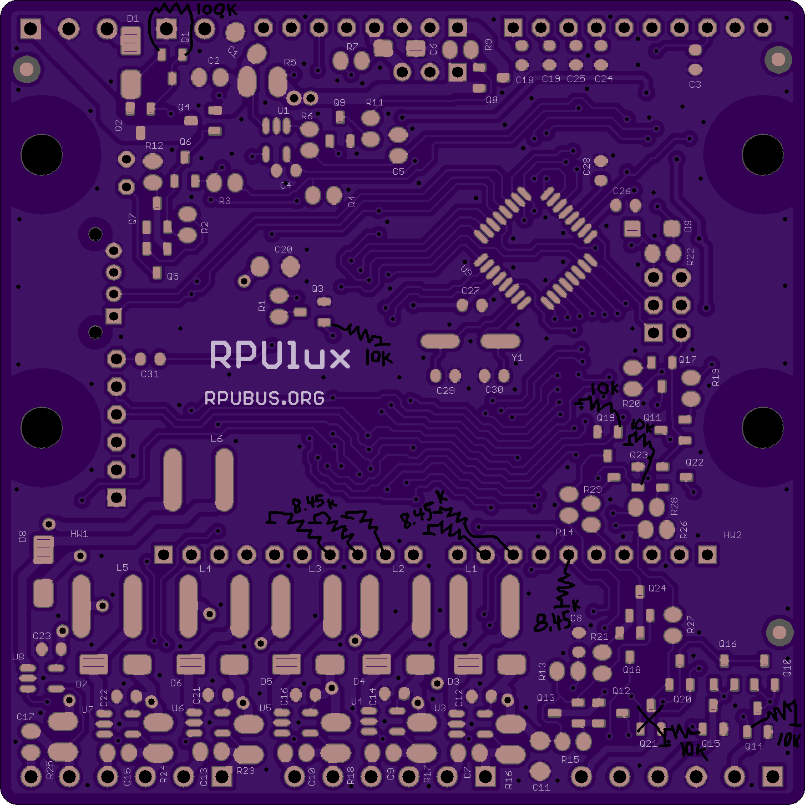

# Description

Some lessons I learned doing RPUlux.

# Table Of Contents:

1. ^1 AL8805 design, mfg layout
1. ^0 SMPS design , current sense resistor
1. ^0 PWR_V divider
1. ^0 Add defaults on IO Controls
1. ^0 Pull Down Alternate Power Control
1. ^0 Solar Panel Zener brakedown failure


## ^1  AL8805 design, mfg layout

My [RPUlux] version ^1 [layout] has less noise on the 0V plane than the first version. The ADC readings from the MCU look right (I sort of figured those were noise related so I ignored that problem).

[RPUlux]: https://github.com/epccs/RPUlux/
[layout]: https://github.com/epccs/Eagle/tree/master/RPUlux

The problem is I am still getting 160mA with .3 Ohm sense from the LED driver (AL8805). Looking at the Diodes example circuit when the switch is off. I see the current flows through D1 and into C6 mostly (some goes to C3 bypass). The magnetic fields from this current are far from the sense lines. 


However when the switch is on the current flow is right under the sense and the magnetic field from that induces a voltage on the sense lines, thus causing the chips sensor input voltage to be different than the sense resistor voltage. It looks to me like the induced voltage works against the voltage on the resistor, so the induced voltage makes the sensed voltage seem less than it is.


This must be how Diodes characterized there part. In order to duplicate there datasheet values guess I would need to run the switched current under the current sense resistor the way they have done. This seems like a questionable way to do the sense for a switch mode power supply.

Replacing the sense resistor with 0.15 Ohm sets the current at about 330mA so this is what I will do.


## ^0  SMPS design, current sense resistor

Every control chip (AL8805) is a teacher. I am seeing about half the current (160mA) that I expect to see with a 0.3 Ohm sense resistor. 

After looking at the Sparkfun Femtobuck I think I see some ideas to try. 

This converter switches the current to 0V, but I need to send the return current into the 10 uF capacitors before it is and then connected to 0V. Because the switching current is on the ground plane I think it is causing the control chip switch on noise events rather than on the sense resistor ramp.

I also did not connect the sense resistor to the AL8805 VIN pin directly and that is causing some error.

The high side current sense is reading about half of what it should durrin SelfTest (DMM reads 60mA), and that is less (12.8V*.06A = .77W) than expected for an LED that should have 1W (e.g. 350mA*3.2V).

```
RPUlux Self Test date: Jan 21 2018
avr-gcc --version: 5.4.0
I2C provided address 0x31 from serial bus manager
adc reading for PWR_V: 359
PWR at: 12.864 V
ADC0 GN LED /W SINK on and CS*_EN off: 0.000 V
ADC1 RD LED /W SINK on and CS*_EN off: 0.000 V
ADC2 R1 /W CS*_EN off: 0.000 V
ADC3 R1 /W CS*_EN off: 0.000 V
CS0 curr source on R1: 0.022 A
Green LED fwd V: 2.239 V
CS1 curr source on R1: 0.023 A
Red LED fwd V: 2.132 V
   ADC2 reading used to calculate ref_intern_1v1_uV: 722 A
   calculated ref_intern_1v1_uV: 1074802 uV
REF_EXTERN_AVCC old value was in eeprom: 5006500 uV
REF_INTERN_1V1 old value was in eeprom: 1073325 uV
REF_EXTERN_AVCC saved in eeprom: 5006500 uV
REF_INTERN_1V1 saved in eeprom: 1074802 uV
PWR_I with CS1_EN and INTERNAL_1V1: 0.013 A
PWR_I with CH1 LED, 1V1, 1sec: 0.031 A
PWR_I with CH1 LED, 1V1, 3sec: 0.031 A
PWR_I with CH2 LED, 1V1, 1sec: 0.030 A
PWR_I with CH2 LED, 1V1, 3sec: 0.030 A
PWR_I with CH3 LED, 1V1, 1sec: 0.031 A
PWR_I with CH3 LED, 1V1, 3sec: 0.030 A
PWR_I with CH4 LED, 1V1, 1sec: 0.030 A
PWR_I with CH4 LED, 1V1, 3sec: 0.030 A
PWR_I with CH5 LED, 1V1, 1sec: 0.030 A
PWR_I with CH5 LED, 1V1, 3sec: 0.030 A
PWR_I with CH6 LED, 1V1, 1sec: 0.029 A
PWR_I with CH6 LED, 1V1, 3sec: 0.030 A
[PASS]
```

PWR_I reads 30mA while a DMM reads 60mA input current. The reading may be noise related, in any case noise improvements need done first.

I think the main issue is that the AL8805 switch current is sent right onto the 0V ground plane. Any place on the plane that the current attempts to flow develop a magnetic field that opposes the flow of that current. This means the current has to flow on the edge of the plane. Following the edge, outline shows that the magnetic fields from the switched current will make a mess all over the board.


Moving things around some seems to give a little more room, so now I can swap the .1uF bypass for a 4.7uF. This also moves the things that are switching current flow (the Diode and the AL8805) to one side and the things with less noise to the other side of the AL8805 with its feedback inputs. The AL8805 0V pin (where the switched current is sent) is connected to an island poor that is connected to the bypass. This means most of the switched current is confined to the edges of this island plane and never goes through the via to the boards larger 0V plane.


## ^0  PWR_V divider

R4 changed from 1.5k to 15.8k Ohm. This is actually the original value I had on the last version of RPUno that was assembled. I decided to try the 1.5k since it would work well
with the 1.1V bandgap referance that I am now calibrating. Unfortuanly a 1% 100k in series with a 1.5k Ohm makes a divider that has a relationship problem. The uncertantly of the 100k is +/-1k and that is nearly the size of the sense resistor. The 100k should be 0.1% if I want to divide it down like that.


## ^0  Add defaults on IO Controls

Controls should have a known defaut so they will do known things when bootloading, powering up, or if the user does not set them.

IO8 needs a 10k pull down to be defined as off by default. Also add 100k to Q1 zener for leakage current.

IO12 (CS0_EN or MISO) and IO13 (CS1_EN or SCK) needs a 10k pull down to be defined as off by default.

IO4 and IO7 needs a 10k pull down so the NMOS SINK is defined as off by default.

IO3, IO5, IO6, IO9, nSS, and MOSI are used for PWM Control and they should to be off by default.

The AL8805 CTRL pin has a 50kOhm resistance to its internal reference (e.g. about 2.5V) and it needs to be brought down to .4V to turn off the converter, which can be done with anything less than 9.5k Ohm. Note 1k Ohm would use 2.5mA at rest and 5mA when turned on I want to use a higher value to reduce the loss, I have 8.45k Ohm on hand. 



## ^0  Pull Down Alternate Power Control

IO8 is used for Alternate Power Control, it needs to be off by default (e.g. bootloading, or if the user does not set it).

## ^0  Solar Panel Zener brakedown failure

Shorting a solar panel without by-pass diodes will cause more than a 10V reverse voltage on a partly shaded cell. That cell will then experience Zener breakdown failure.


