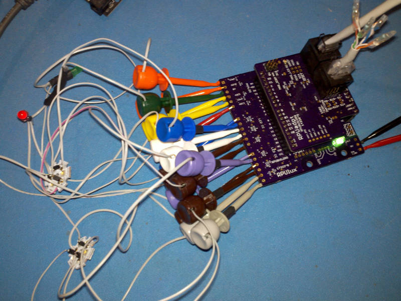

# Description

This is a list of Test preformed on each RPUlux after assembly.

# Table of References


# Table Of Contents:

1. Basics
2. Assembly check
3. IC Solder Test
4. Power Protection
5. Power Without SMPS
6. Bias +5V
7. Set MCU Fuse and Install Bootloader
8. Install SMPS
9. Self Test


## Basics

These tests are for an assembled RPUlux board 17323^0 which may be referred to as a Unit Under Test (UUT). If the UUT fails and can be reworked then do so, otherwise it needs to be scraped. 

**Warning: never use a soldering iron to rework ceramic capacitors due to the thermal shock.**
    
Items used for test.




## Assembly check

After assembly check the circuit carefully to make sure all parts are soldered and correct. The device marking is labeled on the schematic and assembly drawing.
    
NOTE: U2 is not yet on the board, so everything with +5V will not have power.


## IC Solder Test

U2 is not yet populated. Check that a diode drop to 0V is present from a circuit board pad that is connected to each of the pins of U1, and U3 through U9 by measuring with a DMM's diode test set up for reversed polarity. Consult the schematic to determine which pins can be skipped (e.g. ground, power rail, ...).

This is a simplified In-Circuit Test (ICT). It could become more valuable if the node voltage driven with the current source is recorded for each tested location and then used with statistics to determine test limits for each location. 


## Power Protection

Apply a current limited (20mA) supply set with 5V to the PWR and 0V connector J7 in reverse and verify that the voltage does not get through. Adjust the supply to 36V and verify no current is passing.


## Power Without SMPS

Apply a current limited (20mA) supply set with 7V to the PWR and 0V connector J7 and verify that the voltage does get through. Adjust the supply so the LED is on and stable and measure voltage, adjust supply to 30V measure input current. 

NOTE ^0 has been modified so PWM crtl has 8.45k pull down to force the LED current source to be off by default.

```
{ "LEDON_V":[10.7,],
  "PWR@7V_mA":[1.9,],
  "PWR@30V_mA":[3.0,]}
```


## Bias +5V

Apply a 30mA current limited 5V source to +5V (J6). Check that the input current is for a blank MCU (e.g. less than 7mA). Turn off the power.

```
{ "I_IN_BLANKMCU_mA":[3.8,]}
```

## Set MCU Fuse and Install Bootloader

Install Git and AVR toolchain on Ubuntu (17.10, on an old computer try https://wiki.ubuntu.com/Lubuntu). 

```
sudo apt-get install git gcc-avr binutils-avr gdb-avr avr-libc avrdude
```

Clone the RPUlux repository.

```
cd ~
git clone https://github.com/epccs/RPUlux
cd ~/RPUlux/Bootloader
```

Connect a 5V supply with CC mode set at 30mA to +5V (J6). Connect the ICSP tool (J10). The MCU needs its fuses set, so run the Makefile rule to do that. 

```
make fuse
```

Next install the bootloader

```
make isp
```

Disconnect the ISP tool and measure the input current, wait for the power to be settled. Turn off the power.

```
{ "I_IN_16MHZ_EXT_CRYST_mA":[12.9,]}
```

Add U2 to the board now. Measurement of the input current is for referance (takes a long time to settle).


## Install SMPS

Install U2 and measure its output voltage and input current with the supply set at 12.8V and a 30mA current limit. Measure recover voltage after dropout (e.g. PWR voltage at which +5V recovers after droping).

```
{ "+5V_V":[5.00,],
  "PWR12V8_mA":[8.6,],
  "PWR-DR_V":[6.0,]}
```


## Self Test

Plug an [RPUftdi] shield with [Host2Remote] firmware onto an [RPUno] board and load [I2C-Debug] on it.

[RPUftdi]: https://github.com/epccs/RPUftdi
[Host2Remote]: https://github.com/epccs/RPUftdi/tree/master/Host2Remote
[RPUno]: https://github.com/epccs/RPUno
[I2C-Debug]: https://github.com/epccs/RPUno/tree/master/i2c-debug

Use picocom to set the bootload address on the RPUftdi shield. The RPUftdi is at address 0x30 and the UUT will be at address 0x31.

```
picocom -b 38400 /dev/ttyUSB0
...
Terminal ready
/0/iaddr 41
{"address":"0x29"}
/0/ibuff 3,49
{"txBuffer":[{"data":"0x3"},{"data":"0x31"}]}
/0/iread? 2
{"rxBuffer":[{"data":"0x3"},{"data":"0x31"}]}
```
Exit picocom (Cntl^a and Cntl^x). Plug an [RPUadpt] shield with [Remote] firmware onto the UUT board. Note the RPUadpt address defaults to 0x31 when its firmware was installed.

[RPUadpt]: https://github.com/epccs/RPUadpt
[Remote]: https://github.com/epccs/RPUadpt/tree/master/Remote

Connect the Self Test [Harness] to the UUT. Connect a 12.8V supply with CC set at 300mA.

[Harness]: https://raw.githubusercontent.com/epccs/RPUno/master/SelfTest/Setup/SelfTestWiring.png

Once the UUT has power check that the VIN pin on the shield has power (this is not tested by the self-test so it has to be done manually).

Measure the +5V supply at J6.

Edit the SelfTest main.c such that "#define REF_EXTERN_AVCC 5006500UL" has the correct value. Next, run the bootload rule in the Makefile to upload the self-test firmware to the UUT that the remote shield is mounted on.

```
cd ~RPUno/SelfTest
gedit main.c
make bootload
```

Use picocom to see the SelfTest results on the serial interface.

```
picocom -b 38400 /dev/ttyUSB0
picocom v2.2
...
Terminal ready
RPUlux Self Test date: Jan 17 2018
avr-gcc --version: 5.4.0
I2C provided address 0x31 from serial bus manager
adc reading for PWR_V: 349
PWR at: 12.506 V
ADC0 GN LED /W SINK on and CS*_EN off: 0.000 V
ADC1 RD LED /W SINK on and CS*_EN off: 0.000 V
ADC2 R1 /W CS*_EN off: 0.000 V
ADC3 R1 /W CS*_EN off: 0.000 V
CS0 curr source on R1: 0.022 A
Green LED fwd V: 2.225 V
CS1 curr source on R1: 0.022 A
Red LED fwd V: 2.122 V
   ADC2 reading used to calculate ref_intern_1v1_uV: 708 A
   calculated ref_intern_1v1_uV: 1074841 uV
REF_EXTERN_AVCC saved in eeprom: 5006500 uV
REF_INTERN_1V1 saved in eeprom: 1074841 uV
PWR_I with CS1_EN and INTERNAL_1V1: 0.013 A
[PASS]
```

Before truning off the power check that the VIN pin for the shield has no power, the test turns it off. Then turn off the power supply.

```
# toss the change to main.c if you want
git checkout -- main.c
```