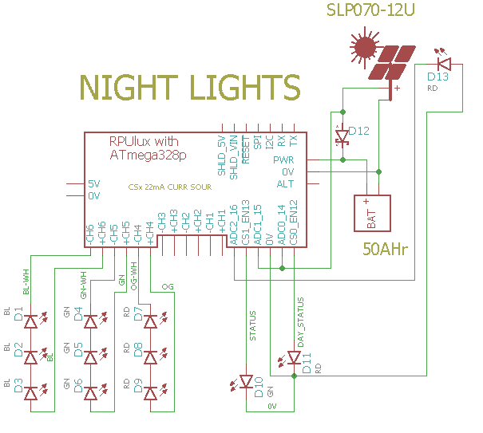

# Night Light

## Overview

RPUlux has six channels that a buck converter regulates at 330mA. The voltage on the LED's needs to be a few volts less than the supply or the switch mode power supply will not be able to regulate the current. An input of 12V means the LED's forward voltage needs to be less than 10V. I use three white [Cree XP-E2] that have 9.75V forward drop and produce about 300 lumen of luminous flux, which is a little less than the luminous flux from a 40W incandecent lamp. 

[Cree XP-E2]: https://www.ledsupply.com/leds/cree-xlamp-xpe2-white-high-power-led

The night light state machine uses non-blocking timers and cycles through the led[channel].cycle_state for each LED channel. The settings are loaded from EEPROM each night after the Day-Night state machine switches from an Evening debounce state to a Night state.

Note: the Night_AttachWork() function is given a callback that is used to reset the charge accumulation values and then load the LED settings from EEPROM and StartLed each night.

# Wiring LED Strings



``` 
RPUlux   328p   (digital)    Function 
------------------------
J1.6     PB3     (11)          LED CHANNEL 6 SINK 350mA
J1.5                           LED CHANNEL 6 SOURCE 350mA
J1.4     PB2     (10)          LED CHANNEL 5 SINK 350mA
J1.3                           LED CHANNEL 5 SOURCE 350mA
J1.2     PB1     (9)           LED CHANNEL 4 SINK 350mA
J2.1                           LED CHANNEL 4 SOURCE 350mA
J2.6     PD6     (6)           LED CHANNEL 3 SINK 350mA
J2.5                           LED CHANNEL 3 SOURCE 350mA
J2.4     PD5     (5)           LED CHANNEL 2 SINK 350mA
J2.3                           LED CHANNEL 2 SOURCE 350mA
J2.2     PD3     (3)           LED CHANNEL 1 SINK 350mA
J2.1                           LED CHANNEL 1 SOURCE 350mA
J3.1     PB4     (12)          RED DAY/NIGHT STATUS
J3.2     PD4     (4)           NMOS SINK ENABLED /W IO4
         A0      (14)          ADC0 MEASURE CURR THRU RDS_ON
J3.4     PD7     (7)           NMOS SINK ENABLED /W IO7
         A1      (15)          ADC1 MEASURE CURR THRU RDS_ON
J3.5     PB5     (13)          GREEN RPU STATUS FROM I2C
J3.6     A2      (16)          ADC2 LIGHT SENSER (RD LED)
``` 

NMOS SINK is not yet tested, and not controled in software.

Warning: the NMOS SINK will damage the solar panel if it does not have bypass diodes.


# EEPROM Memory map 

A map of the LED timer settings in EEPROM. 

```
function            type    ee_addr:L1   L2   L3   L4   L5   L6
id                  UINT16          200  220  240  260  280  300
delay_start_sec     UINT32          202  222  242  262  282  302
runtime_sec         UINT32          206  226  246  266  286  306
delay_sec           UINT32          210  230  250  270  290  310
mahr_stop           UINT32          214  234  254  274  294  314
cycles              UINT16          218  238  258  278  298  318
```

This runs the LED at full power (e.g. no PWM).


# Firmware Upload

With a serial port connection (set the BOOT_PORT in Makefile) and optiboot installed on the RPUlux run 'make bootload' and it should compile and then flash the MCU.

```
git clone https://github.com/epccs/RPUlux/
cd /RPUux/NightLight
make bootload
...
avrdude done.  Thank you.
``` 

Now connect with picocom (or ilk). Note I am often at another computer doing this through SSH. The Samba folder is for editing the files from Windows.

``` 
#exit is C-a, C-x
picocom -b 38400 /dev/ttyUSB0
``` 


# Commands

Commands are interactive over the serial interface at 38400 baud rate. The echo will start after the second character of a new line. 

## /\[rpu_address\]/\[command \[arg\]\]

rpu_address is taken from the I2C address 0x29 (e.g. ../Uart/id.h get_Rpu_address() ). The value of rpu_address is used as a character in a string, which means don't use a null value (C strings are null terminated), but the ASCII value for '1' (0x31) is easy and looks nice, though I fear it will cause some confusion when it is discovered that the actual address value is 49.

The 22mA current source for ADC0 (CS0_EN) is bliked fast (twice per second) if the I2C address is not found, also the rpu_address defaults to '0'. 

Commands and their arguments follow.


## /0/id? \[name|desc|avr-gcc\]

Identify is from ../Uart/id.h Id().

``` 
/1/id?
{"id":{"name":"NightLight","desc":"RPUlux (17323^0) Board /w atmega328p","avr-gcc":"5.4.0"}}
```

##  /0/runled led\[,cycles\] 

Start the led (1..6) operation, with option to override cycles (1..65635). 

If EEPROM settings have not been loaded the LED's retain the initialized values (delay_start = 1+(3*led), runtime = 1, delay = 3600, mahr_stop = MAHR_NOT_SET) that will cause each led to operate for a second after a delay_start time that spaces there operation out by 3 seconds each (it helps to test the setup).

```
/1/runled 1,50
{"LED1":{"delay_start_sec":"1","runtime_sec":"1","delay_sec":"19","cycles":"50"}}
/1/runled 2,50
{"LED2":{"delay_start_sec":"4","runtime_sec":"1","delay_sec":"19","cycles":"50"}}
/1/runled 3,50
{"LED3":{"delay_start_sec":"7","runtime_sec":"1","delay_sec":"19","cycles":"50"}}
/1/runled 4,50
{"LED4":{"delay_start_sec":"10","runtime_sec":"1","delay_sec":"19","cycles":"50"}}
/1/runled 5,50
{"LED5":{"delay_start_sec":"13","runtime_sec":"1","delay_sec":"19","cycles":"50"}}
/1/runled 6,50
{"LED6":{"delay_start_sec":"16","runtime_sec":"1","delay_sec":"19","cycles":"50"}}
```

##  /0/savled led,cycles 

Save the led (1..6) with cycles (1..65635) to EEPROM. A callback function is used to attach the callback_for_night_attach routine that loads these values at the start of the night (i.e. Night_AttachWork).

```
/1/saveled 1,50
{"LED1":{"delay_start_sec":"1","runtime_sec":"3","delay_sec":"2","cycles":"50"}}
/1/saveled 2,50
{"LED2":{"delay_start_sec":"4","runtime_sec":"4","delay_sec":"2","cycles":"50"}}
/1/saveled 3,50
{"LED3":{"delay_start_sec":"7","runtime_sec":"5","delay_sec":"2","cycles":"50"}}
/1/saveled 4,50
{"LED4":{"delay_start_sec":"10","runtime_sec":"5","delay_sec":"2","cycles":"50"}}
/1/saveled 5,50
{"LED5":{"delay_start_sec":"13","runtime_sec":"4","delay_sec":"2","cycles":"50"}}
/1/saveled 6,50
{"LED6":{"delay_start_sec":"16","runtime_sec":"3","delay_sec":"2","cycles":"50"}}
```

##  /0/loadled led

Load the led (1..6) from EEPROM. Use run to start it.

```
/1/loadled 1
{"LED1":{"delay_start_sec":"1","runtime_sec":"3","delay_sec":"2","cycles":"50"}}
/1/loadled 2
{"LED2":{"delay_start_sec":"4","runtime_sec":"4","delay_sec":"2","cycles":"50"}}
/1/loadled 3
{"LED3":{"delay_start_sec":"7","runtime_sec":"5","delay_sec":"2","cycles":"50"}}
/1/loadled 4
{"LED4":{"delay_start_sec":"10","runtime_sec":"5","delay_sec":"2","cycles":"50"}}
/1/loadled 5
{"LED5":{"delay_start_sec":"13","runtime_sec":"4","delay_sec":"2","cycles":"50"}}
/1/loadled 6
{"LED6":{"delay_start_sec":"16","runtime_sec":"3","delay_sec":"2","cycles":"50"}}
```


##  /0/stopled led

Stop a running LED, reduce the delay_start, runtime, and delay to one second each to finish the led (1..6) operation without mixing up the state machine.

To change an led setting use /stop, then /load, and change the desired setting (e.g. /runtime) and finally save it and perhaps /run it.

```
/1/stopled 1
{"LED1":{"delay_start_sec":"1","runtime_sec":"1","delay_sec":"1","cycles":"1"}}
```


##  /0/preled led,delay_start_in_sec

Set the led (1..6) one time delay befor cycles run (1..21600, e.g. 6hr max). 

``` 
/1/preled 1,1
{"LED1":{"delay_start_sec":"1"}}
/1/preled 2,3
{"LED2":{"delay_start_sec":"3"}}
/1/preled 3,5
{"LED3":{"delay_start_sec":"5"}}
/1/preled 4,7
{"LED4":{"delay_start_sec":"7"}}
/1/runled 2,1
{"LED2":{"delay_start_sec":"3","runtime_sec":"1","delay_sec":"13","cycles":"1"}}
``` 


##  /0/runtimeled led,runtime_in_sec

Set the led (1..6) run time (1..21600, e.g. 6hr max). 

``` 
/1/runtimeled 1,3
{"LED1":{"runtime_sec":"3",}}
/1/runtimeled 2,4
{"LED2":{"runtime_sec":"4",}}
/1/runtimeled 3,5
{"LED3":{"runtime_sec":"5",}}
/1/runtimeled 4,5
{"LED4":{"runtime_sec":"5",}}
/1/runtimeled 5,4
{"LED5":{"runtime_sec":"4",}}
/1/runtimeled 6,3
{"LED6":{"runtime_sec":"3",}}
/1/runled 1,1
{"LED1":{"delay_start_sec":"1","runtime_sec":"3","delay_sec":"13","cycles":"1"}}
```


##  /0/delayled led,delay_in_sec

Set the led (1..6) delay between runs (1..86400, e.g. 24 hr max). 

```
/1/delayled 1,2
{"LED1":{"delay_sec":"2"}}
/1/delayled 2,2
{"LED2":{"delay_sec":"2"}}
/1/delayled 3,2
{"LED3":{"delay_sec":"2"}}
/1/delayled 4,2
{"LED4":{"delay_sec":"2"}}
/1/delayled 5,2
{"LED5":{"delay_sec":"2"}}
/1/delayled 6,2
{"LED6":{"delay_sec":"2"}}
/1/runled 3,1
{"LED3":{"delay_start_sec":"5","runtime_sec":"5","delay_sec":"2","cycles":"1"}}
```

##  /0/mahrled led,mAHr

Set the led (1..6) max discharge in mAHr (1..86400, e.g. 86.4AHr). When the battery has been discharged by this amount the LED will stop.

```
/1/mahrled 1,400
{"LED1":{"mahr_stop":"400"}}
/1/mahrled 2,600
{"LED2":{"mahr_stop":"600"}}
/1/mahrled 3,800
{"LED3":{"mahr_stop":"800"}}
/1/mahrled 4,1000
{"LED4":{"mahr_stop":"1000"}}
/1/runled 3,1
{"LED3":{"delay_start_sec":"5","runtime_sec":"4","delay_sec":"2","cycles":"1","mahr_stop":"800"}}
```


##  /0/led? led

Report the led (1..6) runtime in millis.

``` 
/1/led? 3
{"LED3":{"cycle_state":"0","cycles":"0","cycle_millis":"4000"}}
``` 

## [/0/analog? 0..7\[,0..7\[,0..7\[,0..7\[,0..7\]\]\]\]](../Adc#0analog-0707070707)


## [/0/iscan?](../i2c-debug#0iscan)


## [/0/iaddr 0..127](../i2c-debug#0iaddr-0127)


## [/0/ibuff 0..255\[,0..255\[,0..255\[,0..255\[,0..255\]\]\]\]](../i2c-debug#0ibuff-02550255025502550255)


## [/0/ibuff?](../i2c-debug#0ibuff)


## [/0/iwrite](../i2c-debug#0iwrite)


## [/0/charge?](../AmpHr#0charge)


## [/0/day?](../DayNight#0day)