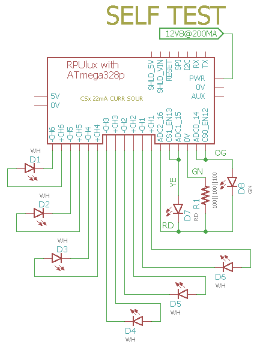

# Self-Test

## Overview

Check RPUlux Board Functions, runs once after a reset and then loops in a pass/fail section.

Note: LED channels are not yet tested

Voltage references are saved in EEPROM for use with Adc and other applications. Measure the +5V supply accurately and set the REF_EXTERN_AVCC value in the main.c file. The band-gap reference is calculated and also saved.

The red and green LED are used to indicate the test status.

## Wiring Needed for RPUlux




## Power Supply

Connect a power supply with CV and CC mode. Set CC at 300mA then increase CV to 12.8V.


## Firmware Upload

With a serial port setup for serial bootloading (see BOOT_PORT in Makefile) and optiboot installed on the RPUlux run 'make bootload' and it should build the code and then flash the MCU.

``` 
make bootload
...
avrdude done.  Thank you.
make clean
``` 

Now connect with picocom (exit is C-a, C-x). 

``` 
picocom -b 38400 /dev/ttyUSB0
picocom v1.7
...
Terminal ready
RPUlux Self Test date: Jan 17 2018
avr-gcc --version: 5.4.0
I2C provided address 0x31 from serial bus manager
adc reading for PWR_V: 349
PWR at: 12.506 V
ADC0 GN LED /W SINK on and CS*_EN off: 0.000 V
ADC1 RD LED /W SINK on and CS*_EN off: 0.000 V
ADC2 R1 /W CS*_EN off: 0.000 V
ADC3 R1 /W CS*_EN off: 0.000 V
CS0 curr source on R1: 0.022 A
Green LED fwd V: 2.225 V
CS1 curr source on R1: 0.022 A
Red LED fwd V: 2.122 V
   ADC2 reading used to calculate ref_intern_1v1_uV: 708 A
   calculated ref_intern_1v1_uV: 1074841 uV
REF_EXTERN_AVCC saved in eeprom: 5006500 uV
REF_INTERN_1V1 saved in eeprom: 1074841 uV
PWR_I with CS1_EN and INTERNAL_1V1: 0.013 A
[PASS]
``` 
