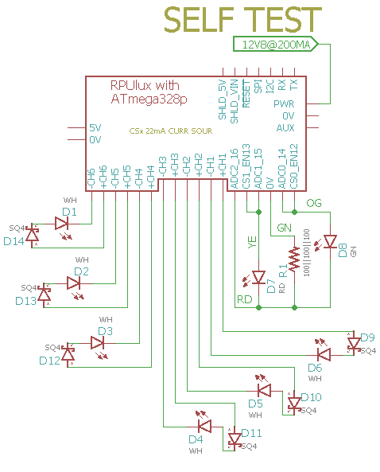

# Self-Test

## Overview

Check RPUlux Board Functions, runs once after a reset and then loops in a pass/fail section.

Note: LED channels are not yet tested

Voltage references are saved in EEPROM for use with Adc and other applications. Measure the +5V supply accurately and set the REF_EXTERN_AVCC value in the main.c file. The band-gap reference is calculated and also saved.

The red and green LED are used to indicate the test status.

## Wiring Needed for RPUlux



Note: blocking diode with LED is to prevent damage when I connect it wrong.


## Power Supply

Connect a power supply with CV and CC mode. Set CC at 300mA then increase CV to 12.8V.


## Firmware Upload

With a serial port setup for serial bootloading (see BOOT_PORT in Makefile) and optiboot installed on the RPUlux run 'make bootload' and it should build the code and then flash the MCU.

``` 
git clone https://github.com/epccs/RPUlux/
cd /RPUux/SelfTest
make bootload
...
avrdude done.  Thank you.
make clean
``` 

Now connect with picocom (exit is C-a, C-x). 

``` 
picocom -b 38400 /dev/ttyUSB0
picocom v2.2
...
Terminal ready
RPUlux Self Test date: Feb 21 2018
avr-gcc --version: 5.4.0
I2C provided address 0x31 from serial bus manager
adc reading for PWR_V: 357
PWR at: 12.740 V
ADC0 GN LED /W SINK on and CS*_EN off: 0.000 V
ADC1 RD LED /W SINK on and CS*_EN off: 0.000 V
ADC2 R1 /W CS*_EN off: 0.000 V
ADC3 R1 /W CS*_EN off: 0.000 V
CS0 curr source on R1: 0.022 A
Green LED fwd V: 2.235 V
CS1 curr source on R1: 0.022 A
Red LED fwd V: 2.133 V
   ADC2 reading used to calculate ref_intern_1v1_uV: 714 A
   calculated ref_intern_1v1_uV: 1068450 uV
REF_EXTERN_AVCC old value was in eeprom: 4986100 uV
REF_INTERN_1V1 old value was in eeprom: 1071451 uV
REF_EXTERN_AVCC saved in eeprom: 4986100 uV
REF_INTERN_1V1 saved in eeprom: 1068450 uV
PWR_I with !CS1_EN use INTERNAL_1V1: 0.011 A
PWR_I with CH1 LED, 1V1, 1sec: 0.100 A
PWR_I with CH1 LED, 1V1, 3sec: 0.099 A
100% CH1 curr on a 3.2V LED: 0.353 A
PWR_I with CH2 LED, 1V1, 1sec: 0.103 A
PWR_I with CH2 LED, 1V1, 3sec: 0.102 A
100% CH2 curr on a 3.2V LED: 0.365 A
PWR_I with CH3 LED, 1V1, 1sec: 0.102 A
PWR_I with CH3 LED, 1V1, 3sec: 0.101 A
100% CH3 curr on a 3.2V LED: 0.360 A
PWR_I with CH4 LED, 1V1, 1sec: 0.099 A
PWR_I with CH4 LED, 1V1, 3sec: 0.099 A
100% CH4 curr on a 3.2V LED: 0.349 A
PWR_I with CH5 LED, 1V1, 1sec: 0.098 A
PWR_I with CH5 LED, 1V1, 3sec: 0.098 A
100% CH5 curr on a 3.2V LED: 0.347 A
PWR_I with CH6 LED, 1V1, 1sec: 0.102 A
PWR_I with CH6 LED, 1V1, 3sec: 0.102 A
100% CH6 curr on a 3.2V LED: 0.362 A
[PASS]
```

The current shown for CH1..CH6 is based on 100% of the input power turning into current thrugh the LED, so it is about 90% right.
