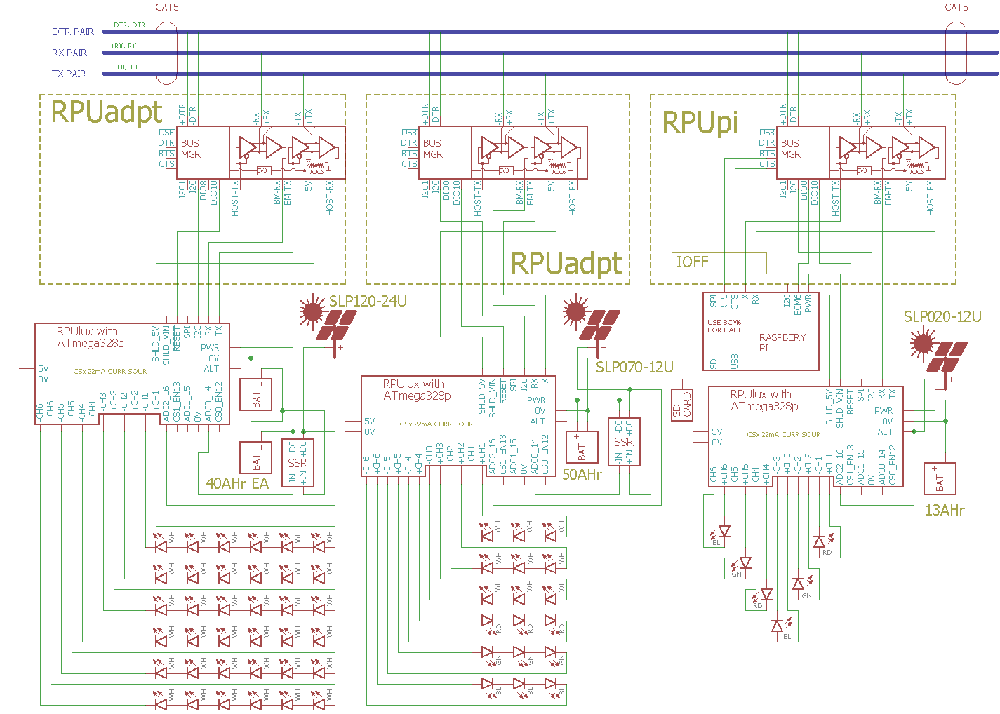

# RPUlux 

From <https://github.com/epccs/RPUlux/>

## Overview

Board with ATmega328p and six AL8805 constant current drivers and headers for multi-drop serial Shields

This programmable ATmega328p based board has headers for a [RPUpi] or [RPUadpt] mezzanine shield. User's firmware application can monitor the input current with a high side current sense (ZXCT1087) with ADC channel six, and the input voltage with a voltage divider on channel seven. Six AL8805 based constant current sources are provided for LED strings. The current sources are PWM modulated with the OCnA and OCnB outputs from Timer0, Timer1, and Timer2. 

[RPUpi]: https://github.com/epccs/RPUpi/
[RPUadpt]: https://github.com/epccs/RPUadpt/

[Forum](http://rpubus.org/bb/viewforum.php?f=19)

[HackaDay](https://hackaday.io/project/60522-rpulux)


## Status

Available through [Tindie](https://www.tindie.com/products/11903/)

[](https://travis-ci.org/epccs/RPUlux)


## [Hardware](./Hardware)

Hardware files include a schematic, bill of materials, and various notes for testing and evaluation. [Layout] files are seperate.

[Layout]: https://github.com/epccs/Eagle/


## Example

This example shows a serial bus that allows multiple microcontroller boards to be connected to a single host computer serial port. It has an [RPUpi] shield that has the Raspberry Pi Zero's hardware UART connect as a networking host. The Pi runs Linux which does SSH connections and Samba file sharing. The other controller boards use an [RPUadpt] shield to daisy-chain the serial with CAT5 cables. 



An RPUlux has six channels for LED lights. Each channel can be dimmed with a PWM controlled pin from the ATmega328p. To my eyes, the PWM values have eight intensity steps (1, 3, 7, 15, 31, 63, 127, 255). I do not see much difference between 126 and 127 or 250 and 255.


## AVR toolchain

The core files for this board are in the /lib folder. Each example has its files and a Makefile in its own folder. The toolchain is available as standard packages on Ubuntu and Raspbian. 

```
sudo apt-get install git gcc-avr binutils-avr gdb-avr avr-libc avrdude
git clone https://github.com/epccs/RPUlux/
```

* [gcc-avr](http://packages.ubuntu.com/search?keywords=gcc-avr)
* [binutils-avr](http://packages.ubuntu.com/search?keywords=binutils-avr)
* [gdb-avr](http://packages.ubuntu.com/search?keywords=gdb-avr)
* [avr-libc](http://packages.ubuntu.com/search?keywords=avr-libc)
* [avrdude](http://packages.ubuntu.com/search?keywords=avrdude)

I like to place a [Bootloader] on the bare metal microcontroler with an ISP tool. 

[Bootloader]: https://github.com/epccs/RPUlux/tree/master/Bootloader

```
cd RPUlux/Bootloader
# note /dev/ttyACM0 it is my ICSP tool.
make fuse
make isp
```

The other applications are loaded through the bootloader using the host serial port. 

```
cd ~/RPUlux/Adc
# note /dev/ttyUSB0 is my FTDI USBuart, and /dev/ttyAMA0 is my Raspberry Pi
make bootload
```

The software is a guide, it is in C because that is my preference when lacking an operating system.


## Continuous Integration

Continuous Integration (CI) is the practice of automatically compiling and testing each time the mainline source is updated (e.g. git push). Travis CI is using a painfully out of date version of Ubuntu (14.04) as there host environment for doing the test build. The build machine allows pulling in any packages I want including the AVR cross compiler. I don't do anything fancy, just run make. A rule like "make test" could be used if the test build machine had hardware connected (e.g. "make bootload" and then "make test") to the machine, but that is not practical in the foreseeable future. This board was painless to set up for Travis because the ATmega328p was in production and Arduino was so popular at that time that the founders were starting to fight for a chance to get rich.

[https://travis-ci.org/epccs/RPUlux](https://travis-ci.org/epccs/RPUlux)


## Arduino IDE

An [example] using the Arduino IDE.

[example]: ./Arduino

On this board the Arduino IDE can use the [Uno's AVR core] files that are included with the IDE (my [core] files are C rather than C++), just remember to look at the schematic to see how the "Uno" is connected. I do not use the Arduino core but did start with it before figuring out that C++ [OOP] features used unmanaged [heap memory], and as the stack, and heap collided my programs did strange things (it was educational).

[Uno's AVR core]: https://github.com/arduino/Arduino/tree/master/hardware/arduino/avr/cores/arduino
[core]: https://github.com/epccs/RPUlux/tree/master/lib
[OOP]: https://medium.com/@brianwill/object-oriented-programming-a-personal-disaster-1b044c2383ab
[heap memory]: https://www.gribblelab.org/CBootCamp/7_Memory_Stack_vs_Heap.html


## Visual Studio Code

VSC is an editor with some IDE features, it is happy with Makefiles. The feature that is driving me to use VSC is [IntelliSense]. It is configured with JSON files in [.vscode]. 

[IntelliSense]: https://code.visualstudio.com/docs/editor/intellisense
[.vscode]: https://github.com/epccs/RPUlux/tree/master/.vscode

IntelliSense needs access to the toolchain includes. The AVR toolchain has some in avr-libc (/usr/lib/avr/include), and gcc-avr (/usr/lib/gcc/avr/5.4.0/include). So I copy them into a Samba share for VSC to see (e.g. Y:/lib/avr-libc, and Y:/lib/gcc-avr) which is also where I edit the source (e.g. Y:/git/RPUlux).


